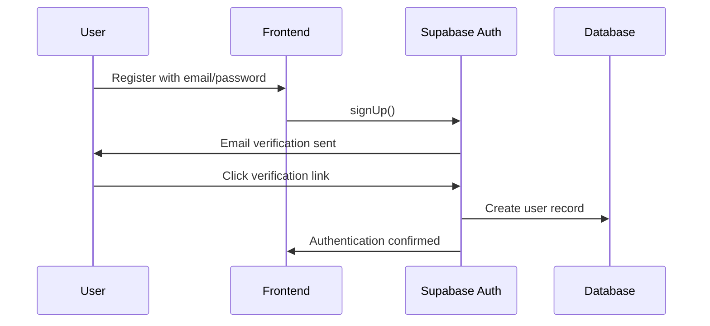
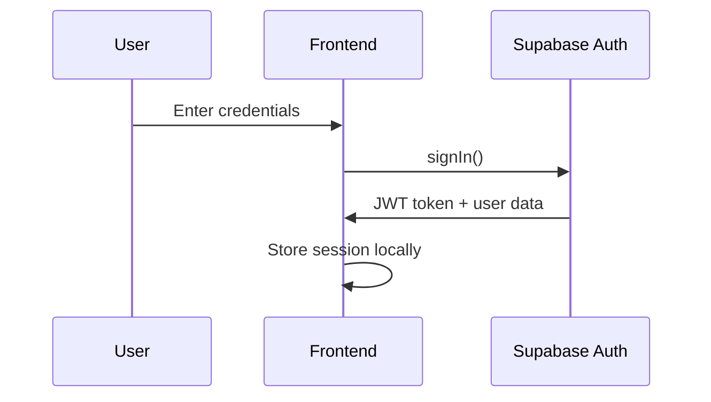

# Authentication & Authorization

This document describes the authentication and authorization requirements for the lunch tracking application.

## Authentication Method

The application uses **Supabase Auth** for user authentication and session management.

### Supported Authentication Methods

1. **Email/Password Authentication** (Primary)
   - User registration with email verification
   - Password reset functionality
   - Secure password requirements

2. **OAuth Providers** (Optional)
   - Google OAuth
   - GitHub OAuth
   - Microsoft OAuth
   - Other providers as needed

## Authentication Flow

### User Registration


### User Login


## JWT Token Structure

Supabase provides JWT tokens with the following claims:

```json
{
  "aud": "authenticated",
  "exp": 1234567890,
  "sub": "user-uuid",
  "email": "user@example.com",
  "phone": "",
  "app_metadata": {
    "provider": "email",
    "providers": ["email"]
  },
  "user_metadata": {
    "email": "user@example.com"
  },
  "role": "authenticated",
  "aal": "aal1",
  "amr": [{"method": "password", "timestamp": 1234567890}],
  "session_id": "session-uuid"
}
```

## Authorization Model

### Role-Based Access Control (RBAC)

Currently, the application uses a simple authorization model:

- **Authenticated Users**: All logged-in users have full access to all features
- **Unauthenticated Users**: No access to any application features

### Row Level Security (RLS)

All database tables have RLS enabled with the following policies:

```sql
-- Example policy for orders table
CREATE POLICY "Authenticated users can manage orders" ON orders
  FOR ALL TO authenticated
  USING (true)
  WITH CHECK (true);
```

### Future Authorization Enhancements

For enterprise use cases, consider implementing:

1. **Team-based Access Control**
   - Users belong to teams/organizations
   - Can only see data for their team
   - Team admins can manage team members

2. **Permission-based Access**
   - Read-only users (view orders/balances)
   - Order managers (create/edit orders)
   - Administrators (manage people/settlements)

## Session Management

### Session Configuration
```typescript
// Supabase client configuration
const supabase = createClient(supabaseUrl, supabaseKey, {
  auth: {
    autoRefreshToken: true,
    persistSession: true,
    detectSessionInUrl: true
  }
})
```

### Session Lifecycle
1. **Session Creation**: On successful login
2. **Session Refresh**: Automatic token refresh before expiration
3. **Session Persistence**: Stored in localStorage/sessionStorage
4. **Session Invalidation**: On logout or token expiration

## API Authentication

### Request Headers
All API requests must include the JWT token:

```http
Authorization: Bearer <jwt_token>
Content-Type: application/json
```

### Authentication Middleware
The backend validates JWT tokens for all protected endpoints:

```typescript
// Example middleware for validating auth
const authenticateUser = async (req: Request, res: Response, next: NextFunction) => {
  const token = req.headers.authorization?.replace('Bearer ', '');
  
  if (!token) {
    return res.status(401).json({ error: 'Authentication required' });
  }

  try {
    const { data: user, error } = await supabase.auth.getUser(token);
    if (error || !user) {
      return res.status(401).json({ error: 'Invalid token' });
    }
    
    req.user = user;
    next();
  } catch (error) {
    return res.status(401).json({ error: 'Authentication failed' });
  }
};
```

## Security Best Practices

### Password Requirements
- Minimum 8 characters
- At least one uppercase letter
- At least one lowercase letter
- At least one number
- At least one special character

### Token Security
- JWT tokens expire after 1 hour
- Refresh tokens expire after 30 days
- Automatic token refresh before expiration
- Secure token storage (httpOnly cookies recommended for production)

### Rate Limiting
Implement rate limiting for authentication endpoints:
- Login attempts: 5 attempts per 15 minutes
- Password reset: 3 attempts per hour
- Registration: 3 attempts per hour per IP

### CORS Configuration
```typescript
// CORS settings for Supabase
const corsOptions = {
  origin: ['http://localhost:3000', 'https://yourdomain.com'],
  credentials: true,
  optionsSuccessStatus: 200
};
```

## Error Handling

### Authentication Errors
```typescript
enum AuthError {
  INVALID_CREDENTIALS = 'Invalid email or password',
  EMAIL_NOT_CONFIRMED = 'Please confirm your email address',
  USER_NOT_FOUND = 'User not found',
  WEAK_PASSWORD = 'Password does not meet requirements',
  EMAIL_ALREADY_REGISTERED = 'Email already registered',
  TOKEN_EXPIRED = 'Session expired, please login again',
  UNAUTHORIZED = 'Unauthorized access'
}
```

### Error Response Format
```json
{
  "error": "Authentication error",
  "code": "INVALID_CREDENTIALS",
  "message": "Invalid email or password",
  "timestamp": "2024-01-01T12:00:00Z"
}
```

## Frontend Integration

### React Auth Hook
```typescript
export const useAuth = () => {
  const [user, setUser] = useState<User | null>(null);
  const [loading, setLoading] = useState(true);

  useEffect(() => {
    // Get initial session
    supabase.auth.getSession().then(({ data: { session } }) => {
      setUser(session?.user ?? null);
      setLoading(false);
    });

    // Listen for auth changes
    const { data: { subscription } } = supabase.auth.onAuthStateChange(
      (_event, session) => {
        setUser(session?.user ?? null);
        setLoading(false);
      }
    );

    return () => subscription.unsubscribe();
  }, []);

  return { user, loading };
};
```

### Protected Route Component
```typescript
export const ProtectedRoute = ({ children }: { children: React.ReactNode }) => {
  const { user, loading } = useAuth();

  if (loading) {
    return <div>Loading...</div>;
  }

  if (!user) {
    return <Navigate to="/login" replace />;
  }

  return <>{children}</>;
};
```

## Testing Authentication

### Test Users
For development/testing, create test users with different scenarios:
- Valid user with confirmed email
- User with unconfirmed email
- User with expired session
- User with invalid credentials

### Authentication Tests
```typescript
describe('Authentication', () => {
  test('should login with valid credentials', async () => {
    const { data, error } = await supabase.auth.signInWithPassword({
      email: 'test@example.com',
      password: 'password123'
    });
    
    expect(error).toBeNull();
    expect(data.user).toBeTruthy();
  });

  test('should reject invalid credentials', async () => {
    const { data, error } = await supabase.auth.signInWithPassword({
      email: 'test@example.com',
      password: 'wrongpassword'
    });
    
    expect(error).toBeTruthy();
    expect(data.user).toBeNull();
  });
});
```